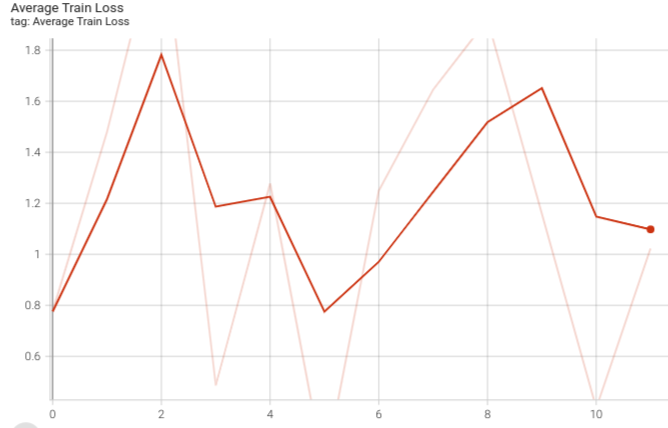

# Implemnting RNN to Generate songs lyrics using Both data from MIDI and Lyrics. 

## Data Processing:
This work was needed two type of data proccesing:
 **lyrics**
 first, i created 2 dictionaries one that transfer words to a token, and one that do the oppsite so i could "translate" the word at the beginig and end of the procces.
secound, i used word2vec model to embedd the words in the lyrics to a vector to use in the model.
**midi files**
i implmented two diffrent type of feature extraction proccess. one extract either melody features form the midi files and the other that extract rythmic features from the files. 

## The model:
My model include two GRU layers folowing two linear layers, the GRU layers are the RNN part of the model, meant to proccess the information, and the linear layers are for mapping the output back to the Vocubaluary size.

## Training the model:
I implemented **Teacher Forcing** for training to model to get better answeres and help the model "go to the right direction", also i added a DropOut layer as  a regularization method to avoid over-fitting. 

## Model Preformence and Results :
**Just melody Train and Validation loss:**

**melody and ryhtem Train and Validation loss:**

**Generating songs**
heres and example of generating song using only the melody of: **Blink 182 song all the small things**, and the first word : **War**

